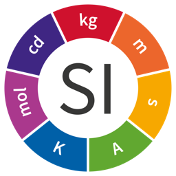
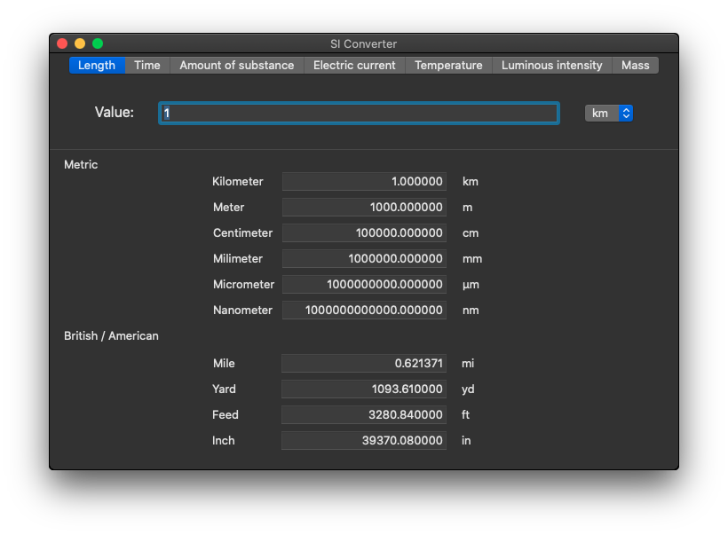
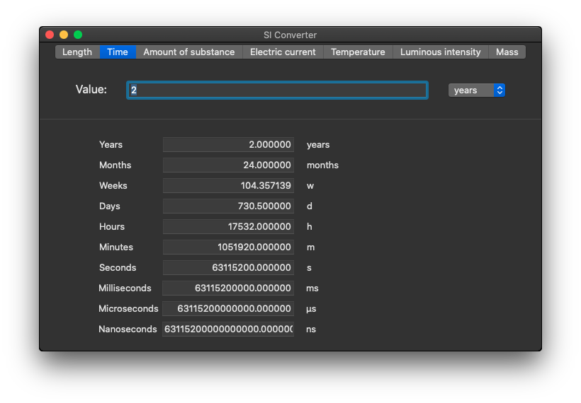
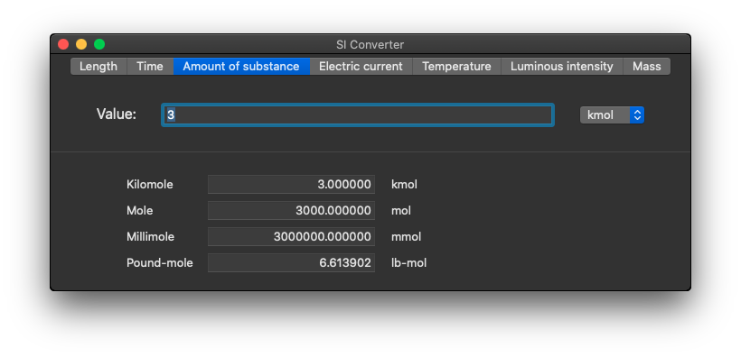
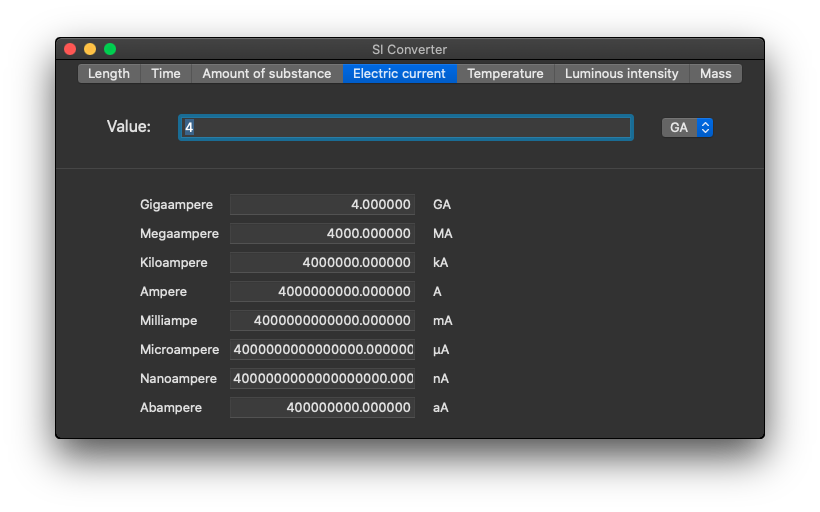
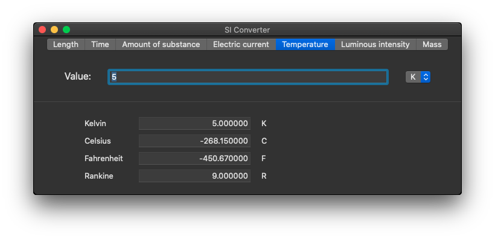
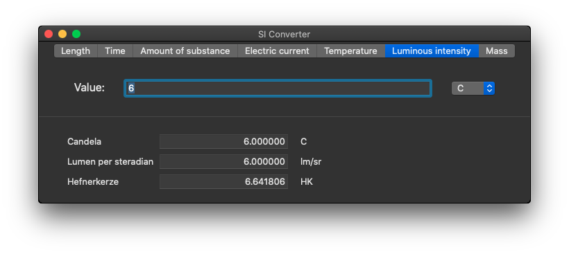
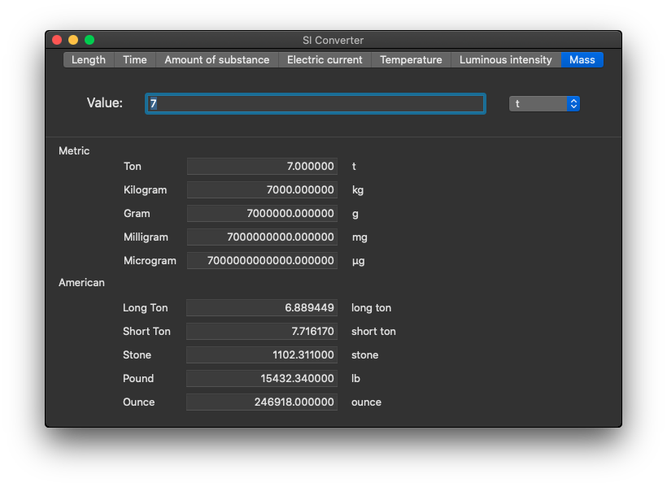

# SI Converter

  

## MacOS application, totally written in Swift, to make conversions of the 7 basic units.

The seven SI base units, which are comprised of:

- [Length - meter (m)](#length)
- [Time - second (s)](#time)
- [Amount of substance - mole (mole)](#amount-of-substance)
- [Electric current - ampere (A)](#electric-current)
- [Temperature - kelvin (K)](#temperature)
- [Luminous intensity - candela (cd)](#luminous-intensity)
- [Mass - kilogram (kg)](#mass)

### Length

### Time

### Amount of substance

### Electric current

### Temperature

### Luminous intensity

### Mass

## More info about units

[Link](https://www.nist.gov/pml/weights-and-measures/metric-si/si-units)

## Help me!

